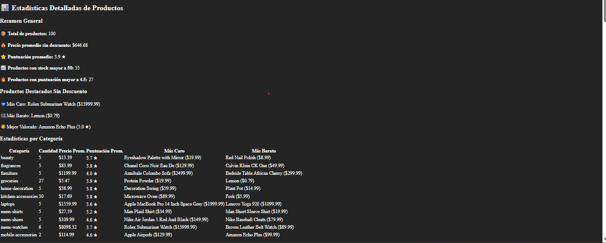
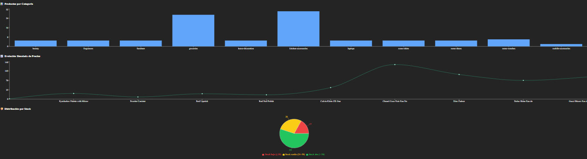
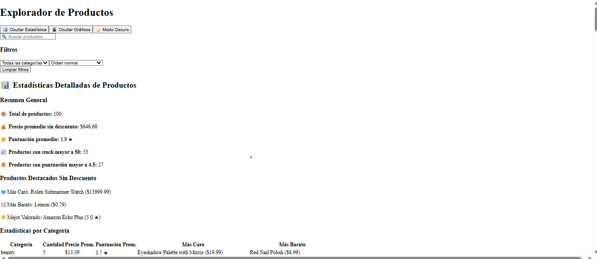
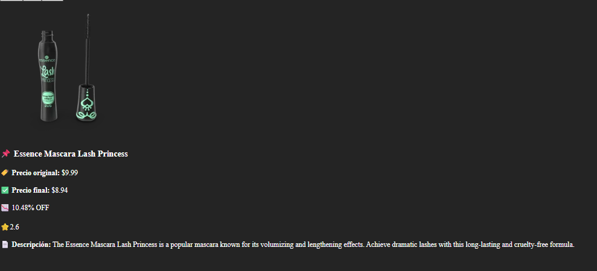
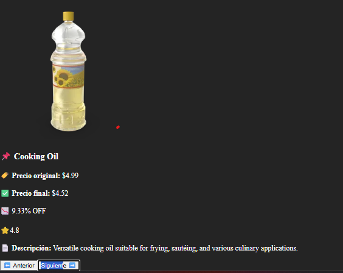
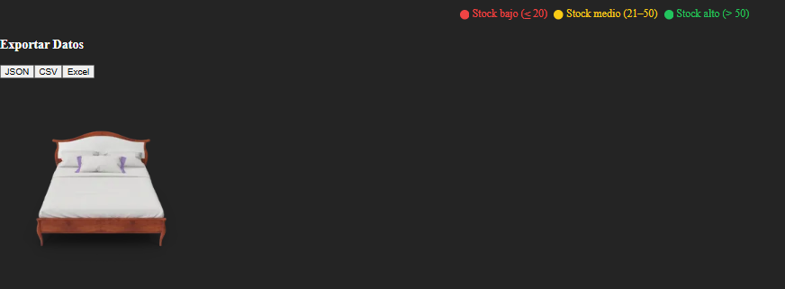

# 🛍️ Explorador de Productos con React

Aplicación web que muestra productos desde la API **DummyJSON**, con **filtros avanzados**, **estadísticas dinámicas**, **paginación**, **modo oscuro**, y **exportación de datos**.

## 📌 Características Principales
- **Búsqueda en tiempo real**: Filtra productos por nombre.
- **Filtros avanzados**:
  - Ordenar por precio ascendente/descendente.
  - Filtrar por categoría, con opción "Todas las categorías".
  - Mostrar solo productos con alto puntaje.
  - **Botón de limpiar filtros**, que reinicia ajustes y restaura "Todas las categorías".
- **Estadísticas dinámicas**:  
  - Producto más caro y más barato.  
  - Porcentaje de descuento promedio.  
  - Precio total de productos seleccionados.  
- **Gráficos interactivos**:
  - Comparación de precios en barras y líneas.
  - Análisis de descuentos con gráficos dinámicos.
  - Distribución de categorías con gráficos de pastel.
- **Paginación avanzada**:
  - Navegación entre páginas de productos.
  - Botones "Anterior" y "Siguiente" para moverse entre páginas.
- **Modo oscuro persistente**:
  - Se guarda en `localStorage`.
  - Alterna entre modo claro y modo oscuro con un solo clic.
- **Exportación de datos**:
  - Exportación de productos en formato **JSON** o **CSV**.

## 🛠️ Tecnologías Utilizadas
- **React** + **Vite** (Entorno rápido de desarrollo).
- **Tailwind CSS** (Diseño moderno y responsivo).
- **Axios** (Conexión a la API de [DummyJSON](https://dummyjson.com/products)).
- **Hooks de React**: `useState`, `useEffect`, `useMemo` (Gestión de estado y rendimiento).
- **LocalStorage** (Persistencia del modo oscuro).
- **Componentes reutilizables**: `ProductList`, `StatsPanel`, `Filters`, `ChartsPanel`, `ExportButton`.

## 🚀 Instalación y Uso
1. **Clona el repositorio**:
   ```bash
   git clone https://github.com/Migueerm/proyecto-integrador-evidencias
   cd proyecto-integrador-evidencias

2. **Instala dependencias**:
  ```bash
  npm install

3. **Inicia el proyecto**:
  ```bash
  npm run dev

## 📷 Capturas de Pantalla

Aquí tienes las secciones recomendadas para documentar la aplicación con capturas de pantalla:

### 🏠 Vista general de la aplicación
Muestra la página principal con los productos, el buscador y los filtros.


### 📊 Estadísticas en tiempo real
Presenta los datos clave, como el producto más caro, más barato y el descuento promedio.  


### 📈 Gráficos de datos
Visualización de información con gráficos interactivos, incluyendo precios y descuentos.  


### 🌙 Interfaz en modo oscuro
Ejemplo de cómo cambia la apariencia al activar el modo oscuro.  


### 🛍️ Detalle de un producto
Muestra la tarjeta con la imagen, precio, descripción y calificación de un producto.  


### 🔄 Paginación funcionando
Demuestra el uso de los botones "Anterior" y "Siguiente" para navegar entre páginas de productos.  


### 📂 Exportación de datos
Captura de la funcionalidad para generar archivos JSON/CSV con los productos filtrados.  

