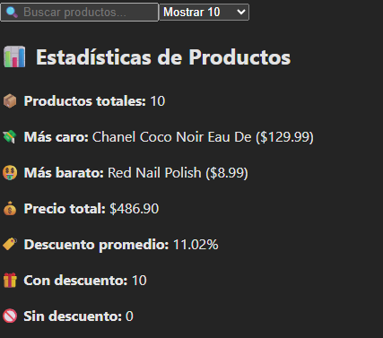
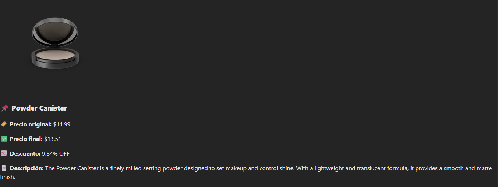

# 🛍️ Aplicación de Productos con React

Aplicación web que muestra productos desde una API generadora de datos random, con filtros dinámicos, estadísticas en tiempo real y diseño responsivo.

## 📌 Características Principales
- **Búsqueda en tiempo real**: Filtra productos por nombre.
- **Estadísticas dinámicas**: 
  - Producto más caro y más barato.
  - Porcentaje de descuento promedio.
  - Precio total de productos seleccionados.
- **Paginación básica**: Selecciona mostrar 10, 15, 20 o 30 (ver todos) productos.
- **Diseño con tarjetas**: 
  - Imágenes de productos.
  - Precio original y con descuento.
  - Descripcion del producto

## 🛠️ Tecnologías Utilizadas
- **React** + **Vite** (Entorno rápido de desarrollo).
- **Tailwind CSS** (Diseño moderno y responsivo).
- **Axios** (Conexión a la API de [DummyJSON](https://dummyjson.com/products)).
- **Hooks de React**: `useState`, `useEffect` (Gestión de estado y efectos).


## 🚀 Instalación y Uso
1. **Clona el repositorio**:
   ```bash
   git clone https://github.com/Migueerm/proyecto-integrador-evidencias
   cd tu-repositorio

## 📷 Capturas de Pantallas
  1. **Estadisticas y menu**
    
  2. **Producto**
    